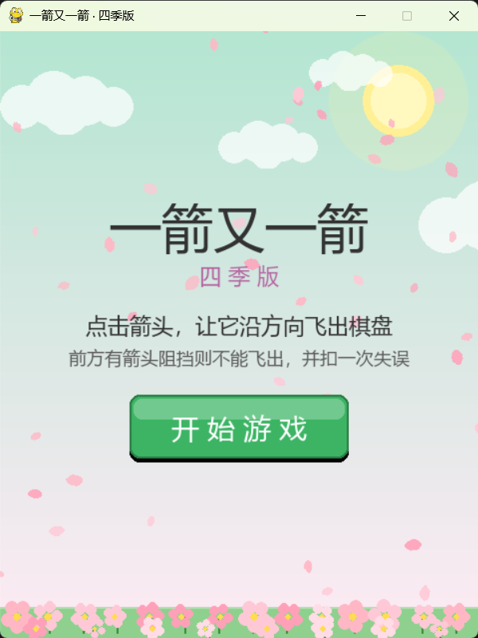
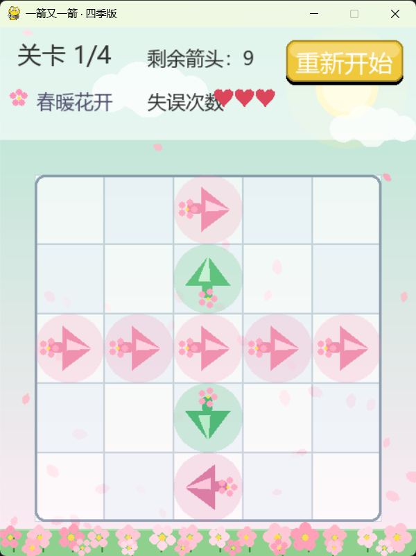
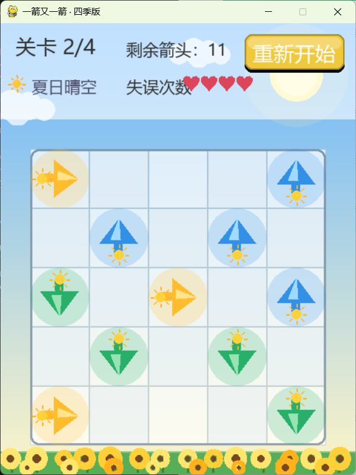
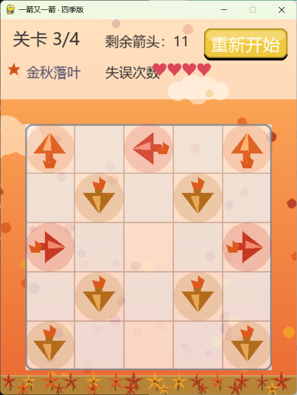
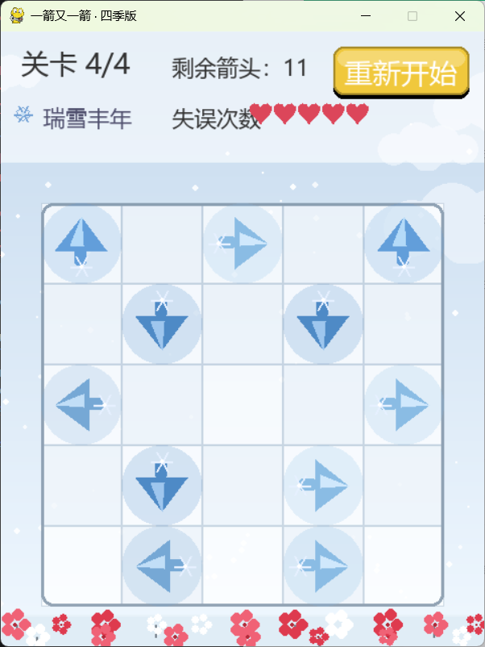
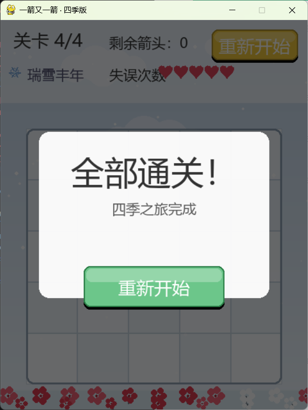
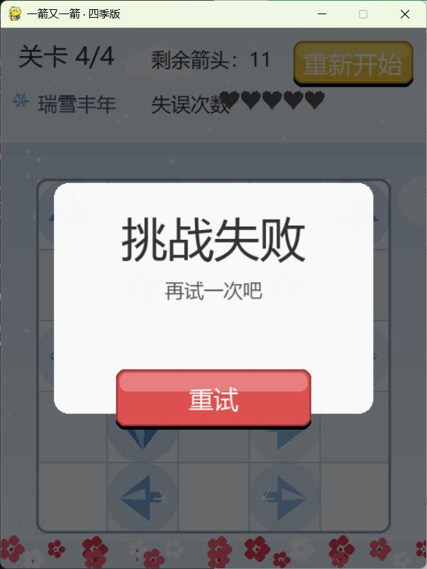

# 一箭又一箭

## 项目名称
一箭又一箭 · 四季版

## 游戏简介
“一箭又一箭”是一款点击式箭头解谜游戏。玩家点击箭头，若其前进方向到棋盘边界之间没有其它箭头，箭头飞出并消失；若有阻挡，则不能消除并消耗一次失误。清空所有箭头即可通关，失误耗尽则失败。

本版本加入四季主题（春、夏、秋、冬）、天气粒子（花瓣、秋叶、雪花）、摇曳花朵、漂浮云朵、箭头飞出爆发粒子等视觉增强。

## 开发环境
- Python 3.13.9（Anaconda base 环境）
- Pygame 2.6.1
- 操作系统：Windows
- 编辑器：VS Code

## 安装和运行方法


pip install pygame
python game.py


## 游戏操作说明
- 鼠标左键点击箭头：让箭头沿其方向飞出棋盘。
- 点击“开始游戏”：从第一关开始。
- 点击“重新开始”：当前关卡恢复初始状态，失误次数重置。
- 点击“下一关”：通关后进入下一关。
- 点击“重试”：失败后重新挑战当前关卡。

## 游戏截图

### 开始界面


### 春之关卡


### 夏之关卡


### 秋之关卡


### 冬之关卡


### 通关界面


### 失败界面


## 项目结构
```
arrow-game/
├── game.py
├── README.md
└── screenshots/
    ├── start.png
    ├── spring.png
    ├── summer.png
    ├── autumn.png
    ├── winter.png
    ├── win.png
    └── lose.png
```

## 关卡说明
| 关卡 | 季节 | 失误上限 |
|---|---|---|
| 第 1 关 | 春 · 春暖花开 | 3 |
| 第 2 关 | 夏 · 夏日晴空 | 4 |
| 第 3 关 | 秋 · 金秋落叶 | 4 |
| 第 4 关 | 冬 · 瑞雪丰年 | 5 |

## 核心实现说明
- **方向编码**：1/2/3/4 分别代表上、右、下、左。
- **棋盘表示**：二维列表 grid，0 为空，其它值表示箭头方向。
- **路径检测**：is_blocked(r, c, direction) 沿箭头方向逐格检查，遇非零格返回 True。
- **碰撞反馈**：箭头晃动、变红，屏幕震动，红色粒子。
- **飞出动画**：箭头飞出棋盘，粒子尾迹与爆发效果。

## 说明
本项目为软件工程课程第二次个人作业，使用 AIGC 工具辅助开发，具体记录见博客。
